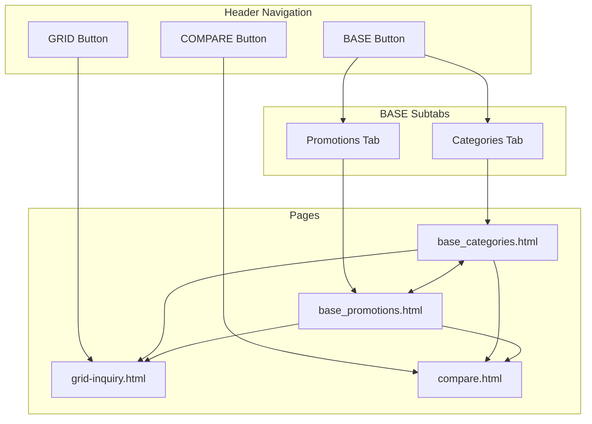
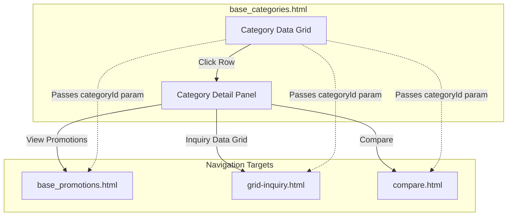
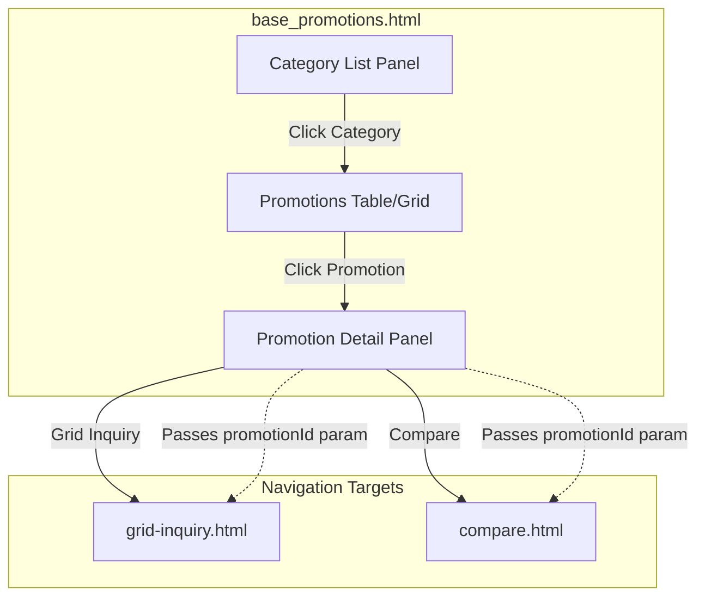
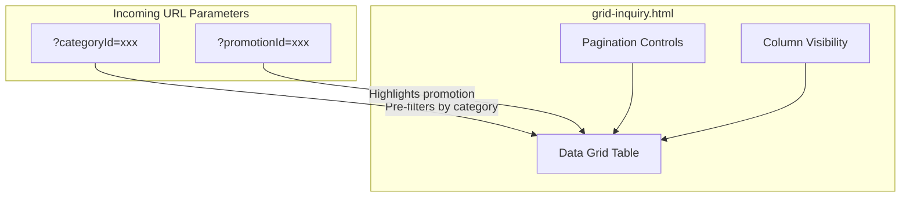
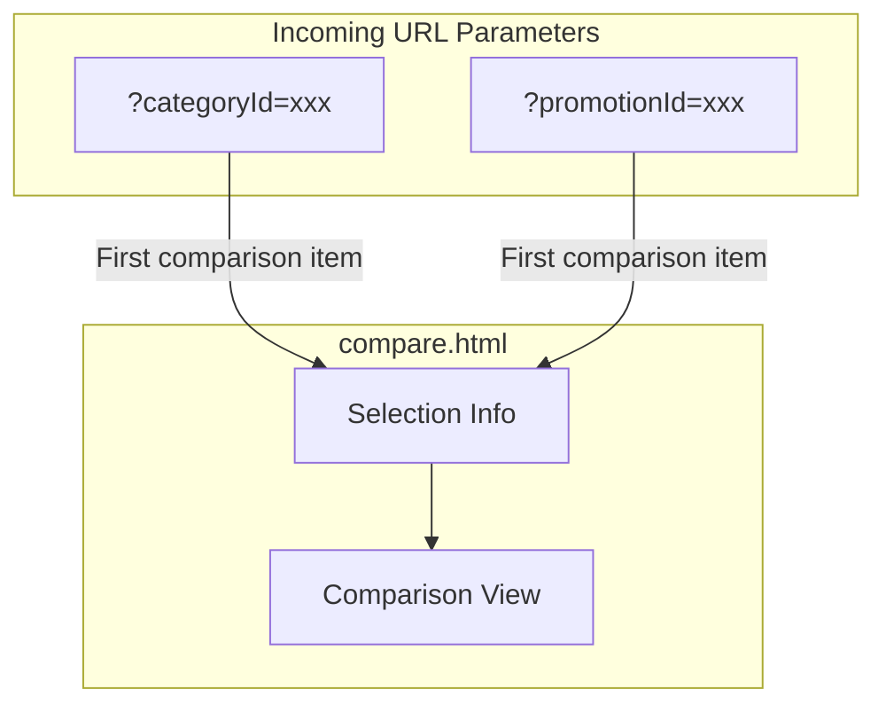
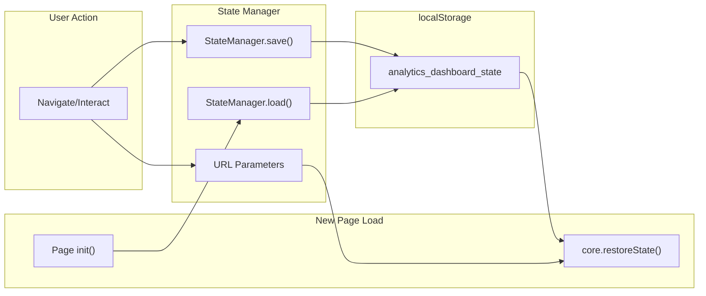
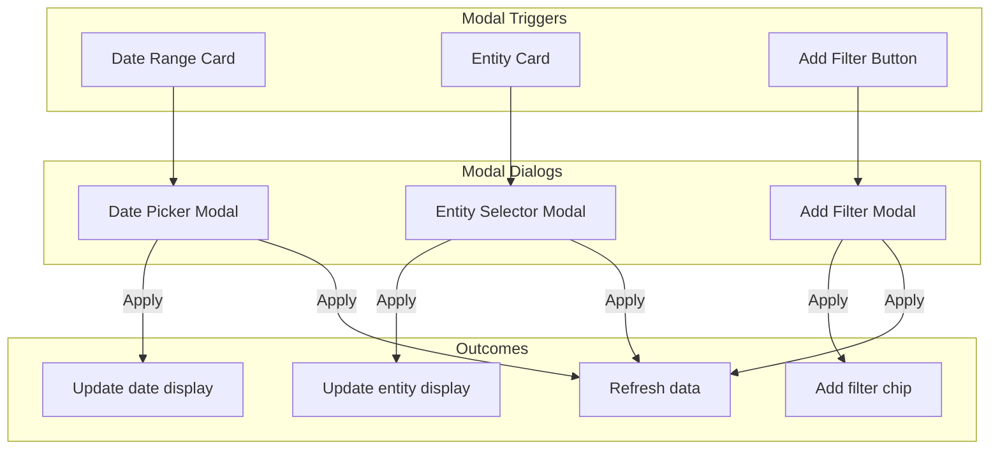
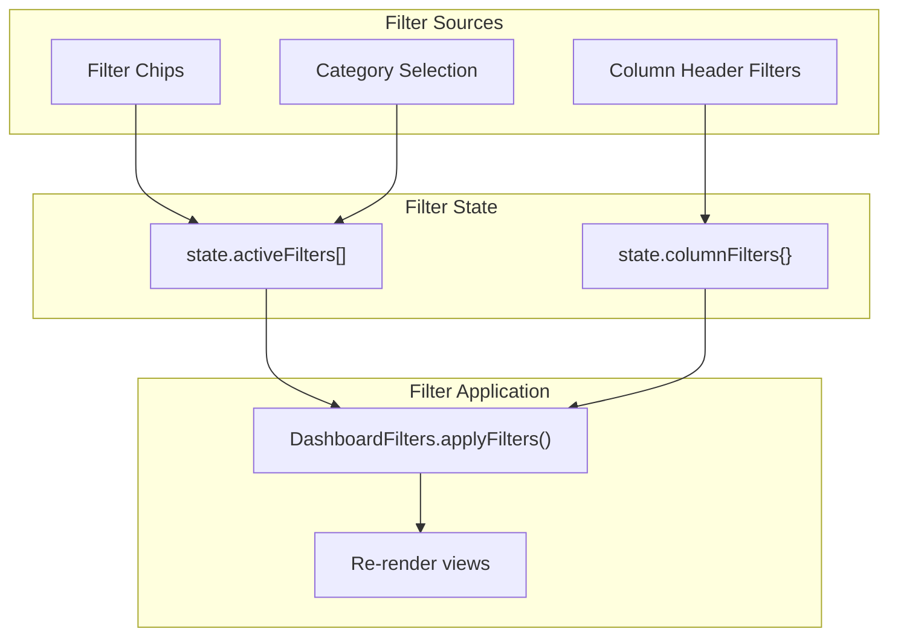
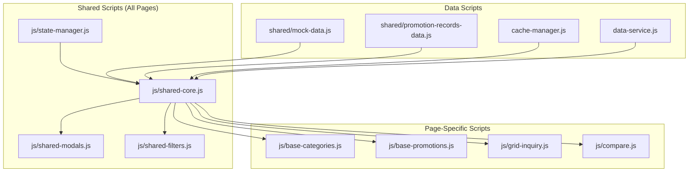

# Analytics Dashboard - Navigation Flows

This document describes all navigation flows within the multi-page Analytics Dashboard application.

## Page Structure

| Page | File | Description |
|------|------|-------------|
| Categories | `base_categories.html` | BASE mode - Category data grid with detail panel |
| Promotions | `base_promotions.html` | BASE mode - Three-column promotion browser |
| Grid Inquiry | `grid-inquiry.html` | GRID mode - Full-width data grid with pagination |
| Compare | `compare.html` | COMPARE mode - Side-by-side comparison view |
| Index | `index.html` | Redirect to base_categories.html |

---

## Main Navigation Flow



---

## Categories Page Flow



---

## Promotions Page Flow



---

## Grid Inquiry Page Flow



---

## Compare Page Flow



---

## State Persistence Flow



---

## Modal Flows



---

## Filter Flow



---

## Testing Checklist

### Navigation Tests (NAV)

| ID | Test | Expected Result |
|----|------|-----------------|
| NAV-01 | Click BASE button from any page | Navigate to base_categories.html |
| NAV-02 | Click Categories subtab | Navigate to base_categories.html |
| NAV-03 | Click Promotions subtab | Navigate to base_promotions.html |
| NAV-04 | Click GRID button | Navigate to grid-inquiry.html |
| NAV-05 | Click COMPARE button | Navigate to compare.html |
| NAV-06 | Category detail: View Promotions | Navigate to base_promotions.html with categoryId |
| NAV-07 | Category detail: Inquiry Data Grid | Navigate to grid-inquiry.html with categoryId |
| NAV-08 | Category detail: Compare | Navigate to compare.html with categoryId |
| NAV-09 | Promotion detail: Grid Inquiry | Navigate to grid-inquiry.html with promotionId |
| NAV-10 | Promotion detail: Compare | Navigate to compare.html with promotionId |
| NAV-11 | Visit index.html | Redirect to base_categories.html |

### State Persistence Tests (STATE)

| ID | Test | Expected Result |
|----|------|-----------------|
| STATE-01 | Set filters, navigate away, return | Filters preserved |
| STATE-02 | Select category, navigate to promotions | Category pre-selected |
| STATE-03 | Change date range, refresh page | Date range preserved |
| STATE-04 | Change entity, navigate between pages | Entity preserved |
| STATE-05 | Sort columns, refresh page | Sort order preserved |
| STATE-06 | Toggle card view, refresh page | View mode preserved |

### UI State Tests (UI)

| ID | Test | Expected Result |
|----|------|-----------------|
| UI-01 | Active navigation highlighting | Current page nav button highlighted |
| UI-02 | Detail panel state | Panel state preserved on refresh |
| UI-03 | Grid column visibility | Column visibility preserved |
| UI-04 | Pagination position | Page position preserved on refresh |

### Filter Tests (FILTER)

| ID | Test | Expected Result |
|----|------|-----------------|
| FILTER-01 | Add category filter | Only ONE category filter allowed |
| FILTER-02 | Add deal type filter | Only ONE deal filter allowed |
| FILTER-03 | Filter chips persist | Chips visible after page navigation |

---

## File Dependencies



---

## URL Parameter Reference

| Parameter | Type | Used By | Purpose |
|-----------|------|---------|---------|
| `categoryId` | string | promotions, grid, compare | Pre-select/filter by category |
| `promotionId` | string | grid, compare | Pre-select/highlight promotion |
| `view` | string | base pages | Specify initial view mode |

---

## localStorage Keys

| Key | Content |
|-----|---------|
| `analytics_dashboard_state` | Full application state JSON |

### State Object Structure

```json
{
  "activeFilters": [],
  "columnFilters": {},
  "selectedWeek": {},
  "selectedEntity": {},
  "categorySortColumn": "name",
  "categorySortDirection": "asc",
  "promoSortColumn": "name",
  "promoSortDirection": "asc",
  "cardViewEnabled": false,
  "moreDataEnabled": false,
  "selectedCategoryId": null,
  "selectedPromotionId": null,
  "gridPage": 1,
  "gridRowsPerPage": 25,
  "gridVisibleColumns": []
}
```
